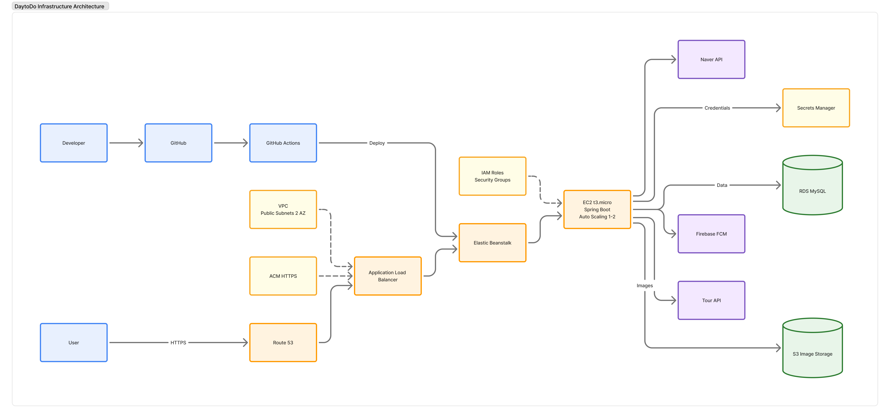

# DayTodo Backend

**소중한 사람과 함께할 하루를 계획하고, 오늘의 추억까지 기록하는 코스 플랫폼**

DayTodo의 인증, 코스 협업, 장소 탐색, AI 추천, 다이어리 및 알림을 담당하는 Spring Boot API 서버입니다.

## 프로젝트 소개

DayTodo는 연인, 가족, 친구 등 소중한 사람과 함께할 코스를 만들고 공유하며, 하루가 끝난 뒤 사진과 기록을 남길 수 있도록 돕는 서비스입니다.

이 저장소는 DayTodo의 백엔드 애플리케이션으로 다음 역할을 수행합니다.

- 이메일·비밀번호 및 네이버 소셜 로그인, JWT 기반 인증
- 초대 코드를 이용한 코스 생성 및 멤버 참여
- 장소 검색, 저장, 정렬과 코스별 장소 관리
- Gemini 기반 장소 후보 추천 및 예상 가격 추론
- 코스 추천글, 좋아요, 댓글을 통한 사용자 간 추천
- 오늘의 코스 진행, 방문 완료 처리 및 사진 업로드
- 캘린더와 다이어리를 이용한 일정 및 추억 기록 관리
- 관심 지역, 프로필, 알림 설정, FCM 푸시 알림 관리

## 기술 스택

| 구분 | 기술 |
| --- | --- |
| Language | Java 17 |
| Framework | Spring Boot 4.0.5, Spring MVC, Spring Security |
| Data | Spring Data JPA, MySQL 8.0 |
| Authentication | JWT, OAuth 2.0, BCrypt |
| API Docs | Springdoc OpenAPI (Swagger UI) |
| Storage | AWS S3 |
| Notification | Firebase Cloud Messaging, Spring Mail |
| External API | Naver Login/Local Search, 한국관광공사 TourAPI, Google Gemini |
| Test | JUnit 5, H2, Spring Security Test |
| Infra | AWS Elastic Beanstalk, Nginx, GitHub Actions |

## 시스템 구성



애플리케이션 코드는 도메인 단위 패키지 구조를 사용합니다.

```text
src/main/java/com/daytodo
├── domain
│   ├── auth       # 회원가입, 로그인, 토큰, 이메일 인증
│   ├── course     # 코스, 멤버, 추천, 오늘의 코스, 다이어리
│   ├── place      # 장소 검색, 북마크, 매거진
│   ├── region     # 지역 조회 및 초기 데이터 구성
│   └── user       # 프로필, 관심 지역, 알림, FCM, 피드백
└── global
    ├── apiPayload # 공통 예외 및 오류 응답
    ├── config     # Security, Swagger, 외부 연동 설정
    ├── security   # JWT 발급 및 인증 필터
    └── web        # 헬스 체크
```

## API 도메인

| Base path | 주요 기능 | 인증 |
| --- | --- | --- |
| `/auth` | 회원가입, 로그인, 네이버 로그인/연동, 토큰 재발급, 이메일·비밀번호 인증 | 일부 공개 |
| `/users` | 프로필, 관심 지역, 알림 설정, FCM 토큰, 피드백, 회원 탈퇴 | JWT |
| `/courses` | 코스 생성·참여, 멤버·장소 관리, AI 추천, 오늘의 코스, 다이어리 | JWT 중심 |
| `/places` | 장소 검색, 북마크, 매거진 | JWT |
| `/regions` | 지역 목록 조회 | 공개 |
| `/health` | 서버 상태 확인 | 공개 |

인증이 필요한 요청에는 다음 헤더를 전달합니다.

```http
Authorization: Bearer {access-token}
```

서버 실행 후 상세 요청·응답 명세는 Swagger UI에서 확인할 수 있습니다.

- Swagger UI: `http://localhost:8080/swagger-ui/index.html`

## 로컬 실행

### 1. 요구 사항

- JDK 17
- Docker 및 Docker Compose

Gradle은 Wrapper가 포함되어 있어 별도로 설치할 필요가 없습니다.

### 2. MySQL 실행

```bash
docker compose up -d mysql
```

로컬 DB의 기본 접속 정보는 다음과 같습니다.

| 항목 | 값 |
| --- | --- |
| Host | `localhost:3308` |
| Database | `app_db` |
| Username | `root` |
| Password | `rootpassword` |

### 3. 환경 변수 설정

저장소 루트에서 예시 파일을 복사한 뒤 값을 채웁니다.

```bash
cp .env.example .env
```

최소 실행에 필요한 값은 아래와 같습니다.

```dotenv
DB_URL=jdbc:mysql://localhost:3308/app_db?serverTimezone=Asia/Seoul&characterEncoding=UTF-8
DB_USER=root
DB_PW=rootpassword
JWT_SECRET_KEY=충분히-긴-JWT-서명용-비밀키
NAVER_CLIENT_ID=네이버-클라이언트-ID
NAVER_CLIENT_SECRET=네이버-클라이언트-시크릿
TOUR_SERVICE_KEY=한국관광공사-서비스키
MAIL_USERNAME=메일-발송용-Gmail-주소
MAIL_PASSWORD=Gmail-앱-비밀번호
```

기능별 선택 환경 변수는 다음과 같습니다.

| 변수 | 설명 | 기본값 |
| --- | --- | --- |
| `APP_BASE_URL` | 인증 메일 링크에 사용할 서버 주소 | `https://dev.daytodo.cloud` |
| `GEMINI_API_KEY` | AI 코스 추천 및 가격 추론 API 키 | 없음 |
| `GEMINI_MODEL` | 사용할 Gemini 모델 | `gemini-3.1-flash-lite` |
| `AWS_S3_BUCKET` | 프로필·추억 사진을 저장할 S3 버킷 | 없음 |
| `AWS_REGION` | S3 및 AWS 리전 | 없음 |
| `FIREBASE_ENABLED` | 실제 FCM 발송 활성화 여부 | `false` |
| `FIREBASE_PROJECT_ID` | Firebase 프로젝트 ID | 없음 |
| `GOOGLE_APPLICATION_CREDENTIALS` | Firebase 서비스 계정 JSON 경로 | 없음 |
| `NOTIFICATION_ZONE` | 알림 스케줄 기준 시간대 | `Asia/Seoul` |
| `COURSE_REMINDER_CRON` | 코스 D-1/D-day 알림 생성 주기 | 매일 09:00 |
| `NOTIFICATION_DISPATCH_DELAY_MS` | 미발송 알림 재처리 간격(ms) | `60000` |

> `.env`와 Firebase 서비스 계정 JSON 등 비밀 정보는 저장소에 커밋하지 않습니다.

### 4. 애플리케이션 실행

```bash
./gradlew bootRun
```

정상 실행 여부는 아래 요청으로 확인합니다.

```bash
curl http://localhost:8080/health
```

응답은 `healthy`입니다.

## 테스트 및 빌드

전체 테스트를 실행합니다.

```bash
./gradlew test
```

배포 가능한 실행 JAR을 생성합니다.

```bash
./gradlew clean build
```

생성 결과는 `build/libs`에서 확인할 수 있습니다.

## 배포

`develop` 브랜치로 향하는 Pull Request가 merge되면 GitHub Actions가 다음 작업을 수행합니다.

1. JDK 17 환경에서 애플리케이션 빌드
2. 실행 JAR, `Procfile`, Elastic Beanstalk 설정 패키징
3. AWS Elastic Beanstalk 개발 환경에 배포
4. Nginx를 통해 Spring Boot의 `8080` 포트로 요청 프록시

배포 워크플로는 `.github/workflows/dev-deploy.yml`에서 확인할 수 있습니다.

## 브랜치 및 협업

- 기능 개발은 별도 브랜치에서 진행합니다.
- Pull Request는 프로젝트 템플릿에 따라 관련 이슈, 변경 사항, 실행 결과를 작성합니다.
- `develop`을 대상으로 하는 PR은 최신 변경 사항과 충돌 여부를 확인한 뒤 요청합니다.
